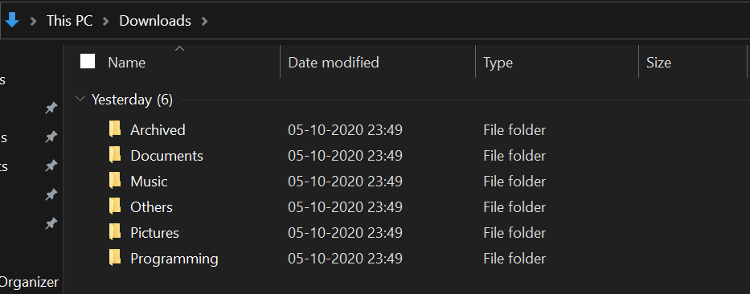

# `Directory Organizer` Package

[](https://gitpod.io/from-referrer/)


[](https://badge.fury.io/py/directory_organizer)

[](https://github.com/ellerbrock/open-source-badges/)

Have a cluttered Folder/Directory? No Worries!

`Directory Organizer` is a simple Python Package that scans your folder directory and moves the specific file types to its type-specific directories.

<b> Currently Available for All Platforms.  </b>

## Class Documentation

```python
class directory_organizer.organizer(path = 'Downloads', verbose = False)
```
By default, `path = 'Downloads'` of the Base OS and `verbosity = False` ie no output to the console regarding files moved. <br>

| __Parameters__ | __Description__ |
|      ---       |      ---        |
|     __path__   | Absolute path to the directory when we want to perform our operations. |
|    __verbose__ | Controls the verbosity ie console output during our operations. | 

### Methods

```python
organizer.showHistory(extension_type = None)
```
Returns a dictionary of the Files that were been moved. <br>
By default, `showHistory()` returns dictionary of the all the file types if no argument has been passed. <br>

| __Parameters__ | __Description__ |
|    ---         |       ---       |
| __extension_type__ | Can be anything among these - ['Documents', 'Pictures', 'Music', 'Videos', 'Archived', 'Programming', Others'] |

if __extension_type__ is passed as an argument, then a dictionary containing moved files will be returned having `extension_type` as type.

Sample Output of `showHistory()` :


---------------------------------------

```python
organizer.showExtensions(extension_type = None)
```
*   Returns a dictionary of the files extensions that are been supported by the Package currently. <br>
By default, `showExtensions()` returns dictionary of the all the file extension types if no argument has been passed. <br>

| __Parameters__ | __Description__ |
|    ---         |       ---       |
| __extension_type__ | Can be anything among these - ['Documents', 'Pictures', 'Music', 'Videos', 'Archived', 'Programming', Others'] |

if __extension_type__ is passed as an argument, then a dictionary containing all file extensions having `extension_type` as type will be returned .

Sample Output of `showExtensions()` :


---------------------------------------

```python
organizer.__version__
```
*   Returns the current package version number.

---------------------------------------

## About

Categorise your files into Pictures, Documents, Music, Videos, Archived, Programming or as Others!

Pictures will be moved to `/home/$user/Pictures` for Unix-based systems or `c:\user\username\Pictures` for Windows, same goes for Documents, Music, Videos etc to their respective folders.


All the classes/methods will be imported under the package `directory_organizer`.

Further File types will be added to existing types to widen support.

<b>Note : </b>
*   By default, Directory Organizer considers base `Downloads` Directory of your OS.
*   If the File-type doesn't match with either of Pictures/Documents/Videos/Music/Archived/Programming file extensions, then it'll be moved to `Others` Directory.

This Package has been developed collectively by [@rahulbordoloi](https://github.com/rahulbordoloi) and [@SouravMzdr](https://github.com/SouravMzdr) which has been published to [PyPI](https://pypi.org/project/directory-organizer/).

## Installation

Run the following command on your terminal to install `directory_organizer`: 

1 .  Installing the Package using `pip`:
```python
pip install directory_organizer
```
OR

```python
pip3 install directory_organizer
```

2 . Cloning the Repository:

```
git clone https://github.com/rahulbordoloi/Directory-Organizer/
cd directory_organizer
pip install -e .
```

## Usage

Run this Script in order to move all the Files to their respective type folders! [Default]


<!--
```python
# Importing Libraries
from directory_organizer import organizer

# Main Method
if __name__ == '__main__':
    organizer()
```
-->

## Outputs

1 . Selecting Directory and Output as `DEFAULT`

```python
>>> from directory_organizer import organizer
>>> organizer()
Moving Document File Extensions ...
Moving Picture File Extensions ...
Moving Music File Extensions ...
No Videos to Move!
Moving Archived File Extensions ...
Moving Programming File Extensions ...
Moving Other File Extensions ...
Time Elapsed :  0.22 seconds
```

2 . Selecting a `Random` Directory with Output `True`.

```python
>>> from directory_organizer import organizer
>>> organizer('C:\Personal\Work\Directory Organizer\Test\Random', True)
Moving Document File Extensions ...
6 Files moved to Documents!
5_6084888091904966894.pdf
5_6293939556248977731.pdf
798073238.pdf
AWS Bucket.csv
B275D17ApplicationForm.pdf
datasets_1111_2005_kidney_disease.csv
Moving Picture File Extensions ...
2 Files moved to Pictures!
About ME.png
_MG_8632 copy.jpg
No Music Files to Move!
Moving Video File Extensions ...
1 Files moved to Videos!
Narcos - Main Trailer - Netflix [HD].mp4
Moving Archived File Extensions ...
1 Files moved to Archived!
one-dark-theme-5.1.1.zip
Moving Programming File Extensions ...
5 Files moved to Programming!
11263_Good_Bad_Customers.ipynb
11263_HR_Analytics.ipynb
Kidney_Disease.ipynb
monocai.jar
saved_model.pb
Moving Other File Extensions ...
2 Files moved to Others!
ngrok.exe
python-3.8.6.exe
Time Elapsed :  0.07 seconds
```

## Screenshots of Result

Before `Organizing` :

 

After `Organizing` :

 

## Developing `Directory Organizer`

To install `directory_organizer`, along with the tools you need to develop and run tests, and execute the following in your virtualenv:

```bash
$ pip install -e .[dev]
```

## Security & Bugs

*   As a security measure, this script *WILL NOT* access files located in any subdirectory unless explicitly stated.
*   Files having the same name as in Source and Target will get __Replaced__. [Caution]

## Contact Author(s)

Name : __Rahul Bordoloi__ <br>
Website : https://rahulbordoloi.me <br>
Email : rahulbordoloi24@gmail.com <br>

Name : __Sourav Mazumdar__ <br>
Email : souravmzdr@gmail.com <br>

[](https://www.python.org/)
[](https://github.com/rahulbordoloi/)
